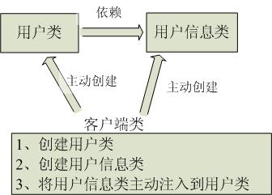
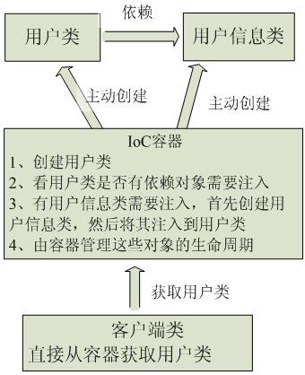

来源于B站


# spring、springMVC、springboot

Spring

- 一站式的轻量级的java开发框架
- 核心是控制反转和面向切面，IOC和AOP
- 针对WEB层，业务层，持久层提供了多种配置解决方案

SpringMVC

- Spring基础上的一个MVC框架，专注web层
- 主要处理web开发中的路径映射和视图渲染

SpringBoot

- 简化MVC的配置流程，脚手架
- 约定大于配置
- 专注于后台接口，前端解耦


# SpringBoot自动装配原理

太难了

源码好多


# SpringMVC工作流程

？？？

Servlet


## 九大组件


# Bean

原帖：[知乎](https://www.zhihu.com/question/19773379)

**什么是Bean**

- 符合一定规范编写的Java类，不是一种技术，而是一种规范。

- 大家针对这种规范，总结了很多开发技巧、工具函数。

- 符合这种规范的类，可以被其它的程序员或者框架使用。


**JavaBean**
JavaBean是公共Java类，但是为了编辑工具识别，需要满足至少三个条件：

1. 有一个public默认构造器（例如无参构造器,）
2. 属性使用public 的get，set方法访问，也就是说设置成private，同时get，set方法与属性名的大小也需要对应。例如属性name，get方法就要写成，public String get**N**ame(){},N大写。
3. 需要序列化。这个是框架，工具跨平台反映状态必须的


1、所有属性为private
2、提供默认构造方法
3、提供getter和setter
4、实现serializable接口

**具体解释**

Java语言欠缺属性、事件、多重继承功能。所以，如果要在Java程序中实现一些面向对象编程的常见需求，只能手写大量胶水代码。Java Bean正是编写这套胶水代码的惯用模式或约定。这些约定包括getXxx、setXxx、isXxx、addXxxListener、XxxEvent等。遵守上述约定的类可以用于若干工具或库。

举个例子，假如有人要用Java实现一个单向链表类，可能会这样写：

```java
// 编译成 java-int-list_1.0.jar
public final class JavaIntList {
  static class Node {
    public Node next;
    public int value;
  }
  public Node head;
  public int size;
}
```

上述实现为了能够快速获取链表的大小，把链表大小缓存在size变量中。用法如下：

```java
JavaIntList myList = new JavaIntList();
System.out.println(myList.size);
```

JavaIntList的作者很满意，于是开源了java-int-list库的1.0版。文件名是java-int-list_1.0.jar。发布后，吸引了许多用户来使用java-int-list_1.0.jar。
有一天，作者决定要节省内存，不要缓存size变量了，把代码改成这样：

```java
// 编译成 java-int-list_2.0.jar
public final class JavaIntList {
  static final class Node {
    public Node next;
    public int value;
  }
  public Node head;
  public int getSize() {
    Node n = head;
    int i = 0;
    while (n != null) {
      n = n.next;
      i++;
    }
    return i;
  }
}
```

然后发布了2.0版：java-int-list_2.0.jar。发布后，原有java-int-list_1.0.jar的用户纷纷升级版本到2.0。这些用户一升级，就发现自己的程序全部坏掉了，说是找不到什么size变量。于是这些用户就把作者暴打一顿，再也不敢用java-int-list库了。

这个故事告诉我们，如果不想被暴打致死，你就必须保持向后兼容性。太阳公司在设计Java语言时，也懂得这个道理。所以Java标准库中，绝对不会出现public int size这样的代码，而一定会一开始就写成：

```java
private int size;
public int getSize() { return size; }
```

让用户一开始就使用getSize，以便有朝一日修改getSize实现时，不破坏向后兼容性。这种public int getSize() { return size; }的惯用手法，就是Java Bean。


# IOC和AOP

> 在软件业，AOP为Aspect Oriented Programming的缩写，意为：[面向切面编程](https://baike.baidu.com/item/面向切面编程/6016335)，通过[预编译](https://baike.baidu.com/item/预编译/3191547)方式和运行期间动态代理实现程序功能的统一维护的一种技术。AOP是[OOP](https://baike.baidu.com/item/OOP)的延续，是软件开发中的一个热点，也是[Spring](https://baike.baidu.com/item/Spring)框架中的一个重要内容，是[函数式编程](https://baike.baidu.com/item/函数式编程/4035031)的一种衍生范型。利用AOP可以对业务逻辑的各个部分进行隔离，从而使得业务逻辑各部分之间的[耦合度](https://baike.baidu.com/item/耦合度/2603938)降低，提高程序的可重用性，同时提高了开发的效率。

要理解切面编程，就需要先理解什么是切面。用刀把一个西瓜分成两瓣，切开的切口就是切面；炒菜，锅与炉子共同来完成炒菜，锅与炉子就是切面。web层级设计中，web层->网关层->服务层->数据层，每一层之间也是一个切面。编程中，对象与对象之间，方法与方法之间，模块与模块之间都是一个个切面。
**为解耦而生**

简单理解：

**将大量出现的，冗余太多的核心代码抽离出来变成一个切面，然后注入代目标对象中**

在AOP中切面就是与业务逻辑独立，但又垂直存在于业务逻辑的代码结构中的通用功能组合；切面与业务逻辑相交的点就是切点；连接点就是把业务逻辑离散化后的关键节点；切点属于连接点，是连接点的子集；Advice（增强）就是切面在切点上要执行的功能增加的具体操作；在切点上可以把要完成增强操作的目标对象（Target）连接到切面里，这个连接的方式就叫织入。

简单总结就一句话：

- **对所有符合规则的一些方法做拦截，先执行我自定义的方法，再执行被拦截的方法**，这个规则就是通过@Pointcut("execution(* com.wangc.demo.controller.*.*(..))")来自定义。

- **这种在运行时，动态地将代码切入到类的指定方法、指定位置上的编程思想就是面向切面的编程。**

**专业的概念定义**：

- Aspect（切面）： Aspect 声明类似于 Java 中的类声明，在 Aspect 中会包含着一些 Pointcut 以及相应的 Advice。
- Joint point（连接点）：表示在程序中明确定义的点，典型的包括方法调用，对类成员的访问以及异常处理程序块的执行等等，它自身还可以嵌套其它 joint point。
- Pointcut（切点）：表示一组 joint point，这些 joint point 或是通过逻辑关系组合起来，或是通过通配、正则表达式等方式集中起来，它定义了相应的 Advice 将要发生的地方。
- Advice（增强）：Advice 定义了在 Pointcut 里面定义的程序点具体要做的操作，它通过 before、after 和 around 来区别是在每个 joint point 之前、之后还是代替执行的代码。
- Target（目标对象）：织入 Advice 的目标对象.。
- Weaving（织入）：将 Aspect 和其他对象连接起来, 并创建 Adviced object 的过程

[原文链接](https://blog.csdn.net/q982151756/article/details/80513340)


> **控制反转**（Inversion of Control，缩写为**IoC**），是[面向对象编程](https://baike.baidu.com/item/面向对象编程/254878)中的一种设计原则，可以用来减低计算机[代码](https://baike.baidu.com/item/代码/86048)之间的[耦合度](https://baike.baidu.com/item/耦合度/2603938)。其中最常见的方式叫做**[依赖注入](https://baike.baidu.com/item/依赖注入/5177233)**（Dependency Injection，简称**DI**），还有一种方式叫“依赖查找”（Dependency Lookup）。通过控制反转，对象在被创建的时候，由一个调控系统内所有对象的外界实体将其所依赖的对象的引用传递给它。也可以说，依赖被注入到对象中。

IoC 不是一种技术，只是一种思想，一个重要的面向对象编程的法则，它能指导我们如何设计出松耦合、更优良的程序。传统应用程序都是由我们在类内部主动创建依赖对象，从而导致类与类之间高耦合，难于测试；有了IoC容器后，把创建和查找依赖对象的控制权交给了**容器**，由容器进行注入组合对象，所以对象与对象之间是 松散耦合，这样也方便测试，利于功能复用，更重要的是使得程序的整个体系结构变得非常灵活。

用图例说明一下，传统程序设计如图，都是主动去创建相关对象然后再组合起来：



当有了IoC/DI的容器后，在客户端类中不再主动去创建这些对象了，如图所示:



DI依赖注入，IOC控制反转。其实差不多一个意思，就是你不用自己创建对象，由容器创建。这个对象就是容器管理的bean。


[原文链接](https://www.zhihu.com/question/335362570/answer/753288166)

# Spring

## 核心

- 为了简化企业开发

- 核心：IOC和AOP
- 容器：管理对象


## 事务传播机制


## 使用了哪些设计模式

1. 工厂模式，BeanFactory
2. 模板模式，ts
3. 代理模式，AOP，动态代理
4. 策略模式，加载资源文件的方式，不同的xxxResourece采用不同的方法
5. 单例模式，创建Bean
6. 观察者模式，
7. 适配器模式
8. 装饰者模式


## 事务的隔离级别


## 事务的实现原理


## 如何简化开发

基于POJO（Plain Old Java Object）**实体类**的轻量级和最小侵入性编程

通过依赖注入和面向接口实现松耦合

基于切面和惯例进行声明式编程

通过切面和模板减少样板式代码


## Bean的作用域

singleton

prototype


## Bean生命周期

简化版：

1. 实例化 Instantiation
2. 属性赋值 Populate
3. 初始化 Initialization
4. 销毁 Destruction


1.Spring对Bean进行实例化（相当于程序中的new Xx()）

2.Spring将值和Bean的引用注入进Bean对应的属性中

3.如果Bean实现了BeanNameAware接口，Spring将Bean的ID传递给setBeanName()方法
**（实现BeanNameAware清主要是为了通过Bean的引用来获得Bean的ID，一般业务中是很少有用到Bean的ID的**）

4.如果Bean实现了BeanFactoryAware接口，Spring将调用setBeanDactory(BeanFactory bf)方法并把BeanFactory容器实例作为参数传入。
**（实现BeanFactoryAware 主要目的是为了获取Spring容器，如Bean通过Spring容器发布事件等）**

5.如果Bean实现了ApplicationContextAwaer接口，Spring容器将调用setApplicationContext(ApplicationContext ctx)方法，把y应用上下文作为参数传入.
**(作用与BeanFactory类似都是为了获取Spring容器，不同的是Spring容器在调用setApplicationContext方法时会把它自己作为setApplicationContext 的参数传入，而Spring容器在调用setBeanDactory前需要程序员自己指定（注入）setBeanDactory里的参数BeanFactory )**

6.如果Bean实现了BeanPostProcess接口，Spring将调用它们的postProcessBeforeInitialization（预初始化）方法
**（作用是在Bean实例创建成功后对进行增强处理，如对Bean进行修改，增加某个功能）**

7.如果Bean实现了InitializingBean接口，Spring将调用它们的afterPropertiesSet方法，作用与在配置文件中对Bean使用init-method声明初始化的作用一样，都是在Bean的全部属性设置成功后执行的初始化方法。

8.如果Bean实现了BeanPostProcess接口，Spring将调用它们的postProcessAfterInitialization（后初始化）方法
**（作用与6的一样，只不过6是在Bean初始化前执行的，而这个是在Bean初始化后执行的，时机不同 )**

9.经过以上的工作后，Bean将一直驻留在应用上下文中给应用使用，直到应用上下文被销毁

10.如果Bean实现了DispostbleBean接口，Spring将调用它的destory方法，作用与在配置文件中对Bean使用destory-method属性的作用一样，都是在Bean实例销毁前执行的方法。


## 如何理解starter

就是一个jar包


## 嵌入式服务器

tomcat


## Bean自动装配

定义：

Bean的**属性**之在进行注入的时候通过某种特定的规则和方式去容器中查找，并**设置**到具体的对象属性中

简化：

自动Set属性

五种方式：

- no
- byName
- byType
- constructor
- autodetect


