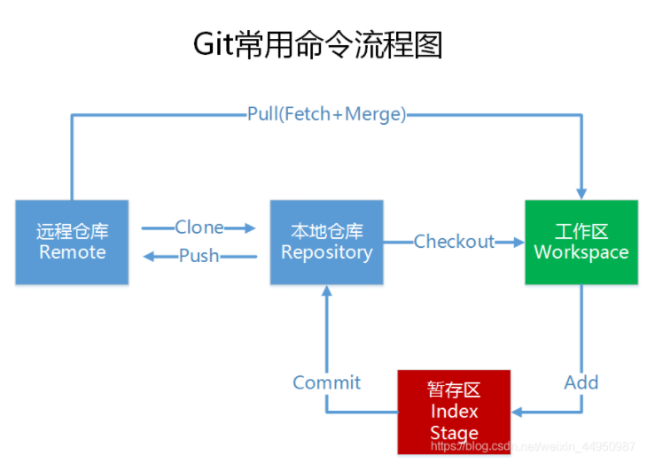
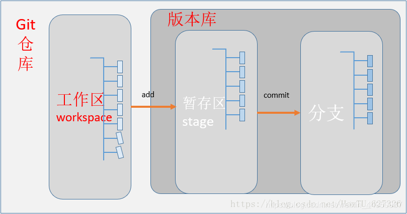
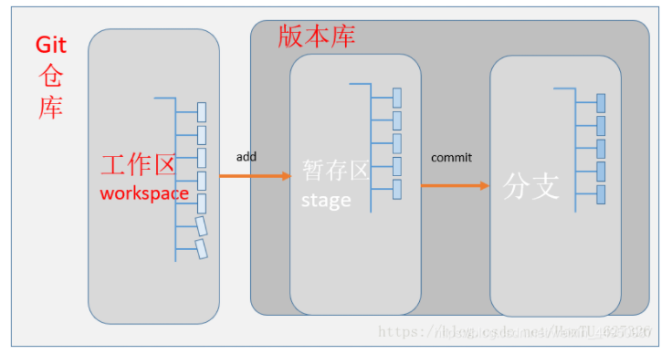

**''填写用户名和邮箱作为一个标识**

```bash
git config --global user.email "1014903184@qq.com"
git config --global user.name "wubin"

```

[参考Blog](https://blog.csdn.net/weixin_44950987/article/details/102619708?ops_request_misc=%257B%2522request%255Fid%2522%253A%2522163650509016780366555406%2522%252C%2522scm%2522%253A%252220140713.130102334..%2522%257D&request_id=163650509016780366555406&biz_id=0&utm_medium=distribute.pc_search_result.none-task-blog-2~all~top_positive~default-1-102619708.pc_search_result_control_group&utm_term=git%E6%95%99%E7%A8%8B&spm=1018.2226.3001.4187)



## 1、创建版本库。

把这个目录变成git可以管理的仓库

```bash
git init
```

在版本库testgit目录下新建一个记事本文件 readme.txt

添加到暂存区:

```bash
git add readme.txt
```

把文件提交到仓库

```bash
git commit -m "reame.tet提交"
```

可以通过命令`git status`来查看是否还有文件未提交

看下readme.txt文件到底改了什么内容

```bash
git diff readme.txt
```

提交修改和提交文件是一样的2步


## 2、版本回退

显示从最近到最远的显示日志

```bash
git log
git log –pretty=oneline
```

把当前的版本回退到上一个版本

```bash
git reset --hard HEAD^
git reset --hard HEAD^100
```

回退到最新的版本

```bash
git reset --hard 版本号
```

获取到版本号

```bash
git reflog
```

## 3、理解工作区与暂存区的区别

**工作区：**就是你在电脑上看到的目录，比如目录下testgit里的文件(.git隐藏目录版本库除外)。或者以后需要再新建的目录文件等等都属于工作区范畴。

**版本库(Repository)**：工作区有一个隐藏目录.git,这个不属于工作区，这是版本库。其中版本库里面存了很多东西，其中最重要的就是stage(暂存区)(或者叫index)，还有Git为我们自动创建了第一个分支master,以及指向master的一个指针HEAD。

我们前面说过使用Git提交文件到版本库有两步：

第一步：是使用 git add 把文件添加进去，实际上就是把文件添加到暂存区。

第二步：使用git commit提交更改，实际上就是把暂存区的**所有内容**提交到当前分支上。

```bash
git commit -m "一次性提交所有文件"
```




## 4.Git撤销修改和删除文件操作

### 4.1撤销修改

丢弃工作区的修改

```bash
git restore -- readme.txt
```

命令 `git restore -- readme.txt` 意思就是，把readme.txt文件在工作区做的修改全部撤销，这里有2种情况，如下：

1. readme.txt自动修改后，还没有放到暂存区，使用 撤销修改就回到和版本库一模一样的状态。
2. 另外一种是readme.txt已经放入暂存区了，接着又作了修改，撤销修改就回到添加暂存区后的状态。

注意：命令`git restore-- readme.txt` 中的 `--` 很重要，如果没有 `--` 的话，那么命令变成创建分支了。


### 4.2删除文件

一般情况下，可以直接在文件目录中把文件删了，或者使用如上rm命令：`rm b.txt` 

如果我想彻底从版本库中删掉了此文件的话，可以再执行`commit`命令 提交掉

## 5.远程仓库

现在我们已经在本地创建了一个Git仓库，又想让其他人来协作开发，此时就可以把本地仓库同步到远程仓库，同时还增加了本地仓库的一个备份。

常用的远程仓库就是github：https://github.com/

### 5.1在github上创建仓库



点击“create repository”按钮仓库就创建成功了。

Github支持两种同步方式“https”和“ssh”。

如果使用https很简单基本不需要配置就可以使用，但是每次提交代码和下载代码时都需要输入用户名和密码。

如果使用ssh方式就需要客户端先生成一个密钥对，即一个公钥一个私钥。然后还需要把公钥放到githib的服务器上。


### 5.2密钥生成

```bash
ssh-keygen -t rsa
```

### 5.3同步到远程仓库

```bash
git remote add origin https://github.com/18515592159zhu/testgit.git
git push -u origin master
```

以后把本地库的内容推送到远程的命令

```bash
git push origin master
```

由于远程库是空的，我们第一次推送`master`分支时，加上了 `–u`参数，Git不但会把本地的master分支内容推送的远程新的master分支，还会把本地的master分支和远程的master分支关联起来，在以后的推送或者拉取时就可以简化命令。


### 5.4从远程库克隆

首先，登录github，创建一个新的仓库，名字叫`testgit2`

使用命令`git clone`克隆一个本地库

```bash
git clone git@github.com:wubin184/testgit2.git
```

接着在我本地目录下 生成`testgit2目录`了


### 5.5创建与合并分支

```bash
git checkout 命令加上 –b参数表示创建并切换，相当于如下2条命令：

git branch dev
git checkout dev

git branch 查看分支，会列出所有的分支，当前分支前面会添加一个星号
```


现在dev分支工作已完成，现在我们切换到主分支master上，继续查看readme.txt内容如下：


把dev分支上的内容合并到分支master上

```bash
git merge dev
```


删除分支

```bash
git branch –d name
```


```bash
查看分支：git branch

创建分支：git branch name

切换分支：git checkout name

创建+切换分支：git checkout –b name

合并某分支到当前分支：git merge name

删除分支：git branch –d name
```


### 5.6解决冲突

