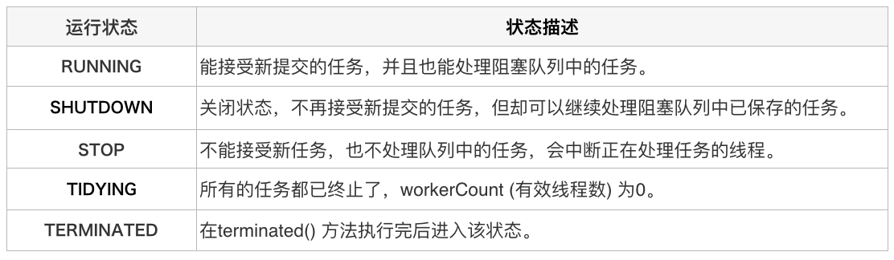
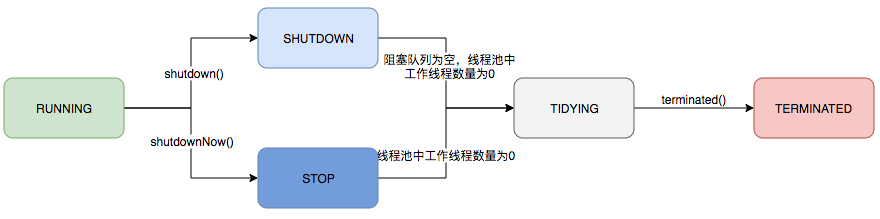
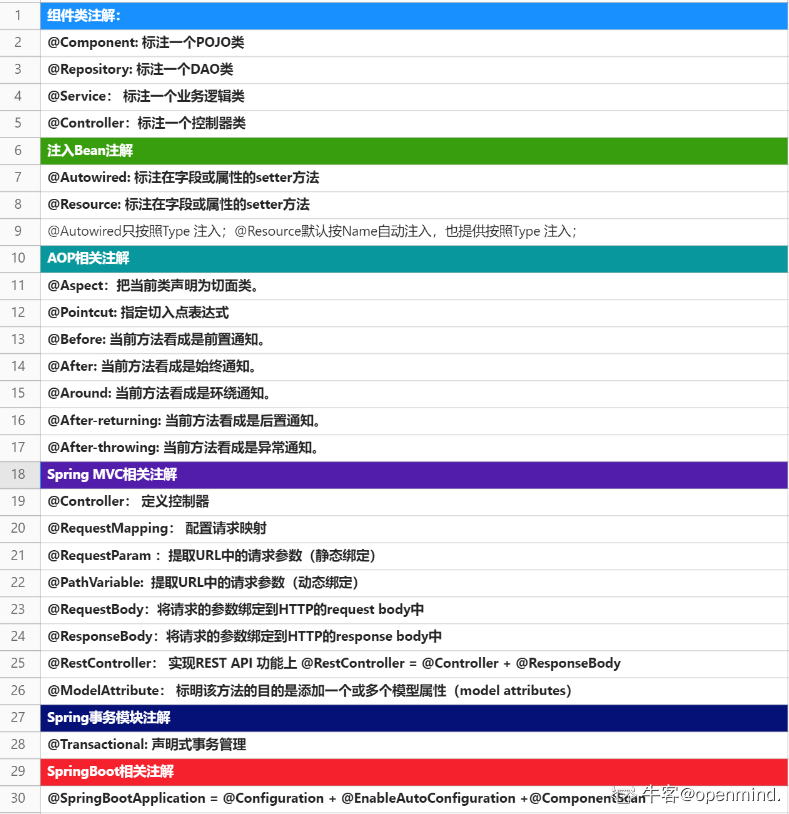

阅文集团面试真题

[牛客网](https://www.nowcoder.com/test/question/done?tid=49874328&qid=1290364#summary)

# 1.ThreadPoolExecutor

**问题：**

详细描述ThreadPoolExecutor的各个参数的含义，介绍一个任务提交到线程池后的执行流程。

**答：**

**corePoolSize** - 池中所保存的线程数，包括空闲线程。

**maximumPoolSize**-池中允许的最大线程数。

**keepAliveTime** - 当线程数大于核心时，此为终止前多余的空闲线程等待新任务的最长时间。

**unit** - keepAliveTime 参数的时间单位。

**workQueue** - 执行前用于保持任务的队列。此队列仅保持由 execute方法提交的 Runnable任务。

**threadFactory** - 执行程序创建新线程时使用的工厂。

**handler** - 由于超出线程范围和队列容量而使执行被阻塞时所使用的处理程序。


**解析答案**：

```shell
核心线程数 表示线程池的常驻核心线程数。刚提交任务的时候，每来一个任务就会创建一个线程，直到达到核心线程数。
最大线程数 用于表示线程池最大能维护的线程数量
过期时间 非核心线程的过期时间
过期单位 非核心线程的过期单位
线程工厂 用来方便标记所使用的线程
任务队列 用来存放未执行的任务
拒绝策略 如果当前线程数达到最大线程数，那么后面的任务将没有可以执行的线程，会根据这个参数执行策略来处理这个任务
4种策略: 1.报错 2.让启动线程池的线程执行 3.丢掉 4.丢掉最早的任务
                
任务提交的流程：首先判断当前线程池里的线程是否大于核心线程数，如果小于，则创建新线程执行任务，如果大于，则看任务队列中能否放下，如果放得下，就放入任务队列中等待被执行，如果放不下，就看是否大于最大线程数，如果小于则继续创建线程执行任务，如果大于了最大线程数，则执行拒绝策略。
```


**对应知识点：**

## 线程池

### 概念

- 线程池在内部实际上构建了一个生产者消费者模型

- 线程池运行机制：

  1. 线程池如何维护自身状态。
  2. 线程池如何管理任务。
  3. 线程池如何管理线程。

- 线程管理部分是消费者，它们被统一维护在线程池内，根据任务请求进行线程的分配，当线程执行完任务后则会继续获取新的任务去执行，最终当线程获取不到任务的时候，线程就会被回收。

- 任务管理部分充当生产者的角色，当任务提交后，线程池会判断该任务后续的流转：

  （1）直接申请线程执行该任务

  （2）缓冲到队列中等待线程执行

  （3）拒绝该任务。


**太长不看版：**

线程池 = 任务管理 + 线程管理 +自我维护 = 生产者 + 消费者

本质：对任务和线程的管理

实现思想：而做到这一点最关键的思想就是将任务和线程两者解耦


### 生命周期管理






### 使用方法

```java
import java.util.concurrent.ArrayBlockingQueue;
import java.util.concurrent.ThreadPoolExecutor;
import java.util.concurrent.TimeUnit;

public class ThreadTest {

    private ThreadPoolExecutor threadpool;

    /**
     * Param:
     * corePoolSize - 池中所保存的线程数，包括空闲线程。
     * maximumPoolSize - 池中允许的最大线程数(采用LinkedBlockingQueue时没有作用)。
     * keepAliveTime -当线程数大于核心时，此为终止前多余的空闲线程等待新任务的最长时间，线程池维护线程所允许的空闲时间。
     * unit - keepAliveTime参数的时间单位，线程池维护线程所允许的空闲时间的单位:秒 。
     * workQueue - 执行前用于保持任务的队列（缓冲队列）。此队列仅保持由execute 方法提交的 Runnable 任务。
     * RejectedExecutionHandler -线程池对拒绝任务的处理策略(重试添加当前的任务，自动重复调用execute()方法)
     */
    public ThreadTest(){
        threadpool=new ThreadPoolExecutor(2, 10, 20, TimeUnit.SECONDS, new ArrayBlockingQueue(10),
                new ThreadPoolExecutor.DiscardOldestPolicy());
    }

    //add task into thread pool
    public void submit(final int flag){
        threadpool.execute(new Runnable(){
            public void run(){
                try {
                    Thread.sleep(2000);
                } catch (InterruptedException e) {
                    e.printStackTrace();
                }
                System.out.println(flag + "   Hello");
            }
        });
    }

    /**
     * close thread pool
     */
    public void shutdown() {
        threadpool.shutdown();
    }

    public static void main(String[] args) {
        ThreadTest t = new ThreadTest();
        for (int i = 0; i < 20; i++) {
            System.out.println("time:" + i);
            t.submit(i);
        }
        System.out.println(">>>>>>>>>>>>>>>>>>>>>>>>>>>>>>>>>>>>>>>>>>>>>>>");
    }
z
    /**
     * 当一个任务通过execute(Runnable)方法欲添加到线程池时：
     * 1.如果此时线程池中的数量小于corePoolSize，即使线程池中的线程都处于空闲状态，也要创建新的线程来处理被添加的任务。
     * 2.如果此时线程池中的数量等于 corePoolSize，但是缓冲队列 workQueue未满，那么任务被放入缓冲队列。
     * 3.如果此时线程池中的数量大于corePoolSize，缓冲队列workQueue满，并且线程池中的数量小于maximumPoolSize，建新的线程来处理被添加的任务。
     * 4.如果此时线程池中的数量大于corePoolSize，缓冲队列workQueue满，并且线程池中的数量等于maximumPoolSize，那么通过
     * handler所指定的策略来处理此任务。也就是：处理任务的优先级为：核心线程corePoolSize、任务队列workQueue、最大线程maximumPoolSize
     * ，如果三者都满了，使用handler处理被拒绝的任务。
     *
     * 5.当线程池中的线程数量大于corePoolSize时，如果某线程空闲时间超过keepAliveTime，线程将被终止。这样，线程池可以动态的调整池中的线程数。
     */
}
```

参考：

[线程池的使用](https://www.oschina.net/question/565065_86540)

[使用2](https://blog.csdn.net/iteye_1084/article/details/82649422?ops_request_misc=%257B%2522request%255Fid%2522%253A%2522163645910516780274151834%2522%252C%2522scm%2522%253A%252220140713.130102334..%2522%257D&request_id=163645910516780274151834&biz_id=0&utm_medium=distribute.pc_search_result.none-task-blog-2~all~sobaiduend~default-1-82649422.first_rank_v2_pc_rank_v29&utm_term=threadpoolexecutor%E4%BD%BF%E7%94%A8%E4%BE%8B%E5%AD%90&spm=1018.2226.3001.4187)

| 序号 | 名称            | 类型                     | 含义             |
| ---- | --------------- | ------------------------ | ---------------- |
| 1    | corePoolSize    | int                      | 核心线程池大小   |
| 2    | maximumPoolSize | int                      | 最大线程池大小   |
| 3    | keepAliveTime   | long                     | 线程最大空闲时间 |
| 4    | unit            | TimeUnit                 | 时间单位         |
| 5    | workQueue       | BlockingQueue<Runnable>  | 线程等待队列     |
| 6    | threadFactory   | ThreadFactory            | 线程创建工厂     |
| 7    | handler         | RejectedExecutionHandler | 拒绝策略         |


链接：https://www.jianshu.com/p/f030aa5d7a28

[实现原理](https://blog.csdn.net/small_love/article/details/112059895?ops_request_misc=%257B%2522request%255Fid%2522%253A%2522163644288616780269838215%2522%252C%2522scm%2522%253A%252220140713.130102334..%2522%257D&request_id=163644288616780269838215&biz_id=0&utm_medium=distribute.pc_search_result.none-task-blog-2~all~top_positive~default-1-112059895.first_rank_v2_pc_rank_v29&utm_term=ThreadPoolExecutor&spm=1018.2226.3001.4187)


# 2.Servlet

Q:请简要说明Servlet中的生命周期

A:

Servlet 加载—>实例化—>服务—>销毁。


# 3.lockSuport


# 4.单例模式


# 5.mapToObject

JavaBean

map


# 6.HashMap

介绍HashMap的数据结构、扩容机制，HashMap与Hashtable的区别，是否是线程安全的，并介绍ConcurrentHashMap的实现机制。


HashMap的数据结构：数组+链表+红黑树，当链表的值大于8的时候，就会转成红黑树存储。

HashMap默认初始容量16，加载因子0.75，当存储容量大于16*0.75的时候，扩容两倍，并将原数据复制到新的数组上。

HashMap是线程不安全的，性能高，用迭代器遍历索引从小到大，初始容量16，扩容是容量*2，HashTable线程安全，性能低，用迭代器遍历索引从大到小，初始容量11，扩容是容量*2 +1；

ConCurrentHashMap是线程安全的，通过进行数据的分段加锁，避免了锁的竞争。


# 7.数据库连接池

Q:介绍数据库连接池的实现方式。如何从连接池中获取连接、将连接放回连接池？使用连接池的优势是什么？列举一下自己用过的连接池。


数据库连接池的基本思想就是为数据库连接建立一个“缓冲池”。预先在缓冲池中放入一定数量的连接，当需要建立数据库连接时，只需从“缓冲池”中取出一个，使用完毕之后再放回去。我们可以通过设定连接池最大连接数来防止系统无尽的与数据库连接,更为重要的是我们可以通过连接池的管理机制监视数据库的连接的数量﹑使用情况，为系统开发﹑测试及性能调整提供依据。


Java中常用的数据库连接池有：DBCP 、C3P0、BoneCP、Proxool、DDConnectionBroker、DBPool、XAPool、Primrose、SmartPool、MiniConnectionPoolManager及Druid等。

# 8.死锁

定义：

死锁是指多个线程因竞争资源而造成的一种僵局（互相等待），若无外力作用，这些进程都将无法向前推进。

条件：

互斥，不剥夺，占有保持，环路等待

如何避免：

银行家算法

资源一次性分配，可剥夺，有序分配，只要有一个就不分配

9.略

# 10.分布式锁

在很多场景中，我们为了保证数据的最终一致性，需要很多的技术方案来支持，比如分布式事务、分布式锁等。有的时候，我们需要保证一个方法在同 一时间内只能被同一个线程执行。在单机环境中，Java中其实提供了很多并发处理相关的API，但是这些API在分布式场景中就无能为力了。也就是说单纯的Java Api并不能提供分布式锁的能力。所以针对分布式锁的实现目前有多种方案：


分布式锁一般有三种实现方式：
1、数据库锁
2、基于Redis的分布式锁
3、基于ZooKeeper的分布式锁


# 11.TCP粘包现象

Q:什么是TCP粘包拆包？为什么会出现粘包拆包？如何在应用层面解决此问题？

A:服务端接收的数据会出现两个数据包粘在一起的情况。

**原因：**

1、TCP是基于字节流的，虽然应用层和传输层之间的数据交互是大小不等的数据块，但是TCP把这些数据块仅仅看成一连串无结构的字节流，没有边界；

2、在TCP的首部没有表示数据长度的字段，基于上面两点，在使用TCP传输数据时，才有粘包或者拆包现象发生的可能。

没有边界，没有长度字段

**解决**：

添加首部，固定长度，设置边界

1、发送端给每个数据包添加包首部，首部中应该至少包含数据包的长度，这样接收端在接收到数据后，通过读取包首部的长度字段，便知道每一个数据包的实际长度了。
2、发送端将每个数据包封装为固定长度（不够的可以通过补0填充），这样接收端每次从接收缓冲区中读取固定长度的数据就自然而然的把每个数据包拆分开来。
3、可以在数据包之间设置边界，如添加特殊符号，这样，接收端通过这个边界就可以将不同的数据包拆分开。


# 12.BIOAIONIO

Q:	请大致描述一下BIO，AIO和NIO的区别？

A:	BIO：同步阻塞式IO，服务器实现模式为一个连接一个线程，即客户端有连接请求时服务器端就需要启动一个线程进行处理，如果这个连接不做任何事情会造成不必要的线程开销，当然可以通过线程池机制改善。 
NIO：同步非阻塞式IO，服务器实现模式为一个请求一个线程，即客户端发送的连接请求都会注册到多路复用器上，多路复用器轮询到连接有I/O请求时才启动一个线程进行处理。 
AIO：异步非阻塞式IO，服务器实现模式为一个有效请求一个线程，客户端的I/O请求都是由OS先完成了再通知服务器应用去启动线程进行处理。 


- 同步(synchronous) IO和异步(asynchronous) IO
- 阻塞(blocking) IO和非阻塞(non-blocking)IO
- 同步阻塞(blocking-IO)简称BIO
- 同步非阻塞(non-blocking-IO)简称NIO
- 异步非阻塞(asynchronous-non-blocking-IO)简称AIO


# 13.加载类

Q:在JAVA语法中加载类的的方式有哪些？


\1. 使用new 静态加载 5

\2. 调用某个 ClassLoader 实例的 loadClass() 方法 8

\3. 调用 Class.forName() 方法 7


# 14.线程编程

建立三个线程A、B、C，A线程打印10次字母A，B线程打印10次字母B,C线程打印10次字母C，但是要求三个线程同时运行，并且实现交替打印，即按照ABCABCABC的顺序打印

```java
package concurrent;

import java.util.concurrent.locks.LockSupport;

public class LockSupportDemo2 {

    static Thread A,B,C;

    public static void main(String[] args) {
        A = new Thread(()->{
            for (int i = 0; i < 10; i++) {
                LockSupport.park();
                System.out.print("A");
                LockSupport.unpark(B);
            }
        });
        B = new Thread(()->{
            for (int i = 0; i < 10; i++) {
                LockSupport.park();
                System.out.print("B");
                LockSupport.unpark(C);
            }
        });
        C = new Thread(()->{
            for (int i = 0; i < 10; i++) {
                LockSupport.unpark(A);
                LockSupport.park();
                System.out.print("C");
            }
        });
        A.start();
        B.start();
        C.start();
    }
}

```


# 15.spring框架中的注解



